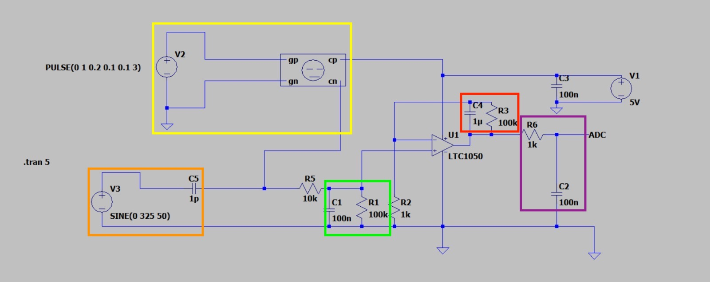

# 2024-2025-4GP-Maelys-chr-Buhahahhahah

## Sommaire

1. [Présentation du projet](#présentation-du-projet)  
2. [Livrables](#livrables)  
3. [Matériel nécessaire](#matériel-nécessaire)  
4. [Simulation du circuit électronique sous LTspice](#simulation-du-circuit-électronique-sous-ltspice)  
5. [Création de notre PCB sous KiCad](#création-de-notre-pcb-sous-kicad)  
6. [Programme Arduino](#programme-arduino)  
7. [Application Android APK sous MIT App Inventor](#application-android-apk-sous-mit-app-inventor)  
8. [Fabrication du shield](#fabrication-du-shield)  
9. [Banc de test](#banc-de-test)   
10. [Datasheet](#datasheet)  
11. [Conclusion](#conclusion)  
12. [Contacts](#contacts)

## 1. Présentation du projet
Ce projet s’inscrit dans le cadre de l’Unité de Formation « Du capteur au banc de test » du département Génie Physique de l’INSA Toulouse. Inspiré de l’article "Pencil Drawn Strain Gauges and Chemiresistor on Paper", publié en 2014 dans Scientific Reports, l’objectif est de concevoir un capteur de déformation low-tech à base de papier et de graphite. 

Le principe repose sur le fait que, lors d’une déformation du papier, la distance entre les particules de graphite préalablement déposées varie selon qu’il s’agisse d’une tension ou d’une compression. Cette variation entraîne une modification de la résistance électrique, et donc de la conductivité de la couche de graphite. Il est ainsi possible de mesurer cette variation de résistance pour en déduire la déformation appliquée. L’objectif du projet était de concevoir ce capteur dans son intégralité, en suivant toutes les étapes de développement : du design et de la fabrication du circuit imprimé (PCB), jusqu’à la programmation et aux tests du capteur.

## 2. Livrables
Pour ce projet, nous avions différents livrables à rendre : 

- Un shield PCB fonctionnel connecté à une carte Arduino UNO. Notre PCB contient un amplificateur transimpédance, un capteur bluetooth, un écran OLED. Ainsi qu'un flex sensor, un servo moteur, un potentiomètre digital et un encodeur rotatoir. Nous avons également rajouter une led de couleur bleu. 
- Un code Arduino permettant de gérer le module bluetooth ainsi que les mesures du capteur de déformation et nos différents composants présent sur notre PCB.
- Une application Android APK développée à l’aide du site MIT app inventor.
- Un Banc de test que nous avons fabriqué
- Une datasheet du capteur de contrainte

## 3. Matériel nécessaire
- Résistances : 1 de 1 kOhms, 1 de 10 kOhms, 2 de 100 kOhms pour l'amplificateur transimpédance. 1 de 320 Ohms pour la Led et 1 de 10 kOhms pour le flex sensor
- Capacités : 2 de 100 nF, 1 de 1 uF pour l'amplificateur transimpédance.
- Arduino Uno
- Amplificateur opérationnel LTC1050
- Module Bluetooth HC05
- Encodeur rotatoire 
- Ecran OLED 128x64
- Potientomètre digital MCP41050
- Flex Sensor
- Servo moteur
- Led
  
## 4. Simulation du circuit électronique sous LTSpice
Ce dossier contient le schéma du circuit analogique associé au capteur graphite. Celui-ci intègre un amplificateur transimpédance ainsi que plusieurs filtres passe-bas, permettant d’obtenir un signal exploitable par la suite.

Le capteur délivre un courant très faible, de l’ordre de 100 nA en moyenne. Sans traitement, ce signal serait difficile à exploiter. L’amplificateur permet donc de convertir ce courant en une tension mesurable, tandis que les filtres atténuent les perturbations indésirables.

Les interférences à 50 Hz, liées au réseau électrique, ainsi que d’autres parasites (bruits de l’alimentation, de l’horloge, etc.) peuvent fortement impacter la qualité du signal. C’est pourquoi un filtrage soigneux est nécessaire.

### Choix de l’amplificateur
Nous avons choisi l’amplificateur opérationnel (AOP) LTC1050 car il est spécifiquement conçu pour traiter de très faibles courants d’entrée. Son offset de tension très faible garantit une grande précision dans la conversion courant/tension.

### Les filtres
Trois filtres ont été intégrés au circuit :

- 🟨 Rectangle jaune : simulation du capteur  
- 🟧 Rectangle orange : simulation du bruit 

Et trois autres filtres, visibles sur le schéma, assurent le nettoyage du signal :

- 🟩 Filtre en entrée (R1, C1 – vert) : filtre passe-bas passif, fréquence de coupure ≈ 160 Hz, pour atténuer les bruits en courant dès l’entrée du signal.  
- 🟥 Filtre dans la boucle AOP (R3, C4 – rouge) : filtre passe-bas actif, fréquence de coupure ≈ 1,6 Hz, efficace contre les interférences à 50 Hz du réseau électrique.  
- 🟪 Filtre en sortie (R6, C2 – violet) : filtre passe-bas avec une fréquence de coupure d’environ 1,6 kHz, pour éliminer les parasites générés lors du traitement du signal.

### Schéma de simulation

## 5. Conception de notre PCB sous Kicad
Cette étape du projet avait pour objectif de concevoir le PCB du circuit transimpédance à l’aide du logiciel KiCad, en s’appuyant sur un template de carte Arduino Uno. Plusieurs étapes ont été nécessaires :

- **Création de la schématique** du circuit transimpédance, incluant la définition de symboles personnalisés pour les composants absents de la bibliothèque KiCad.
- **Conception des empreintes physiques** de ces composants, en prenant en compte leurs caractéristiques techniques : nombre de pins, espacement, dimensions, géométrie, etc.
- **Routage du circuit** généré via la vue schématique.
- **Mise en place d’un plan de masse** pour relier efficacement les pistes au GND.

Voici le schéma électrique de l'ensemble de notre montage :

