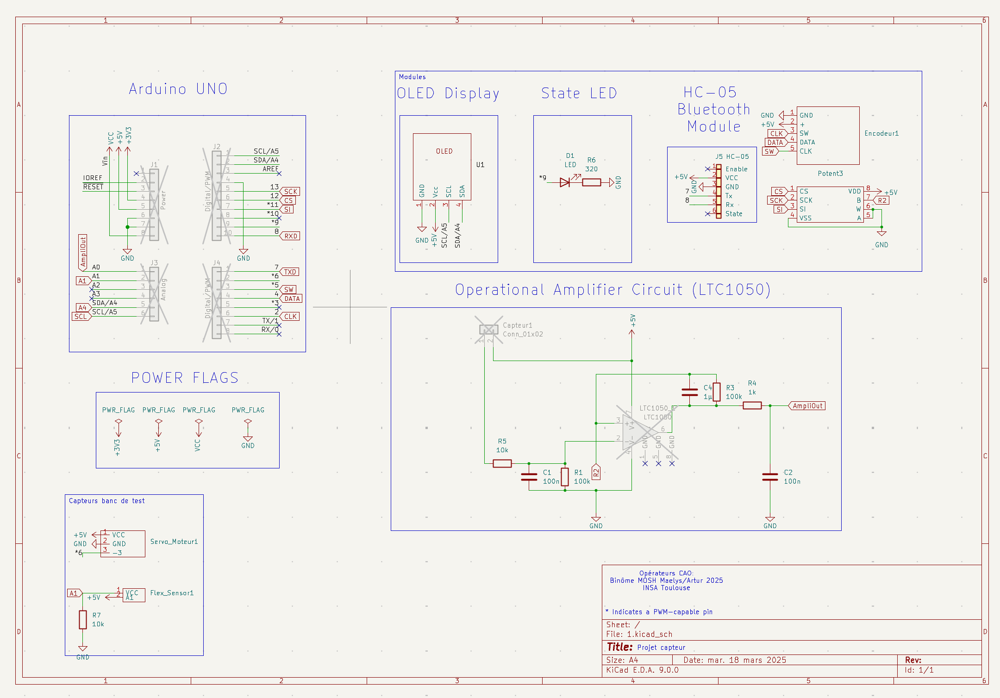
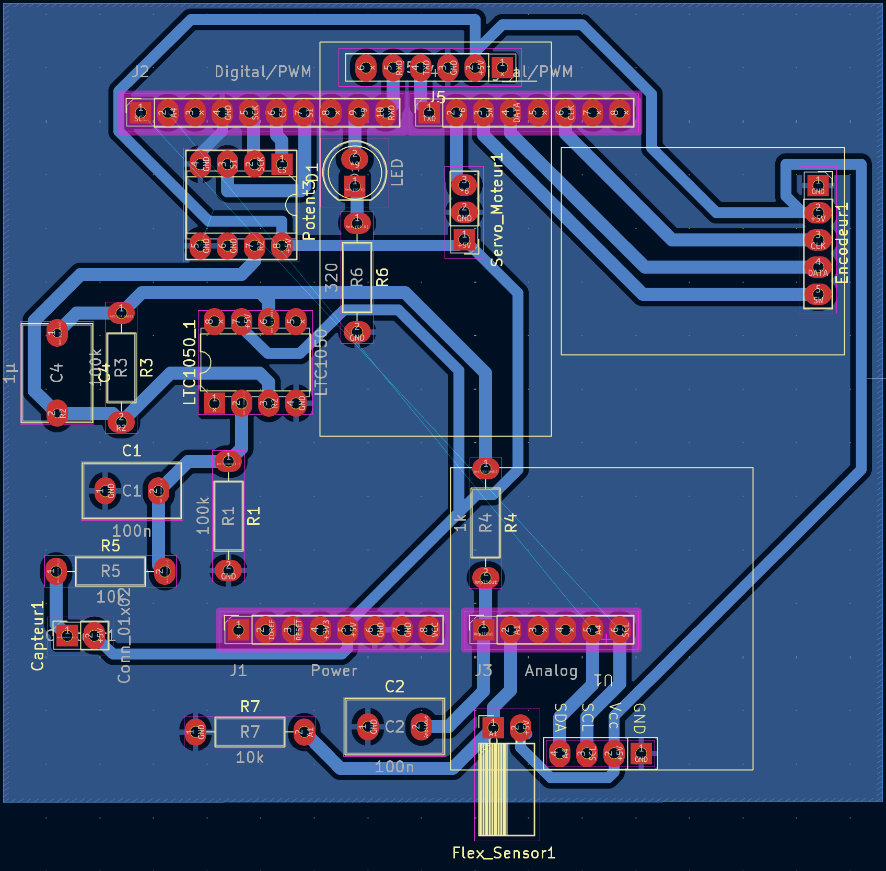
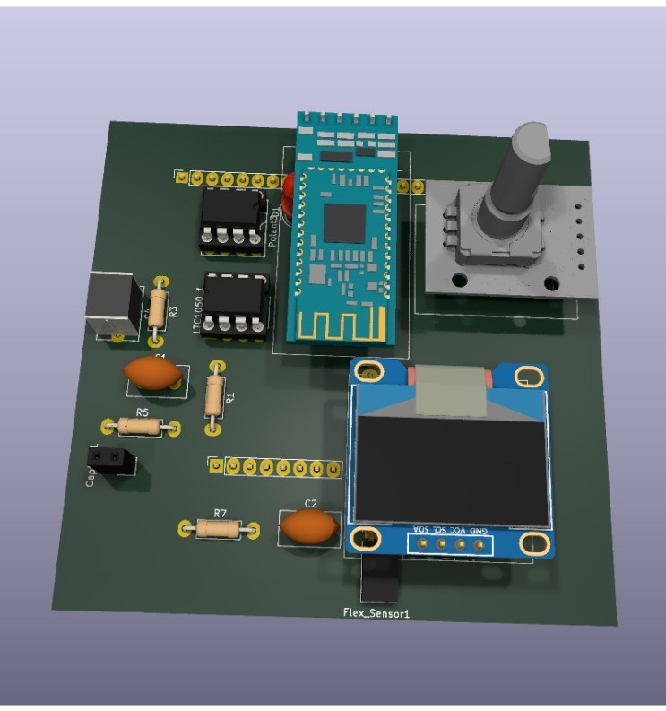
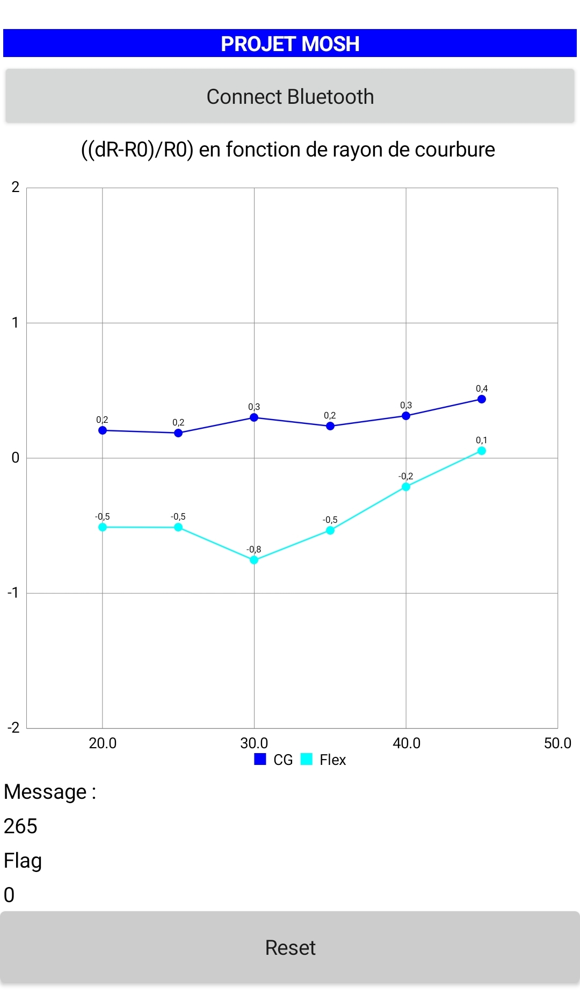
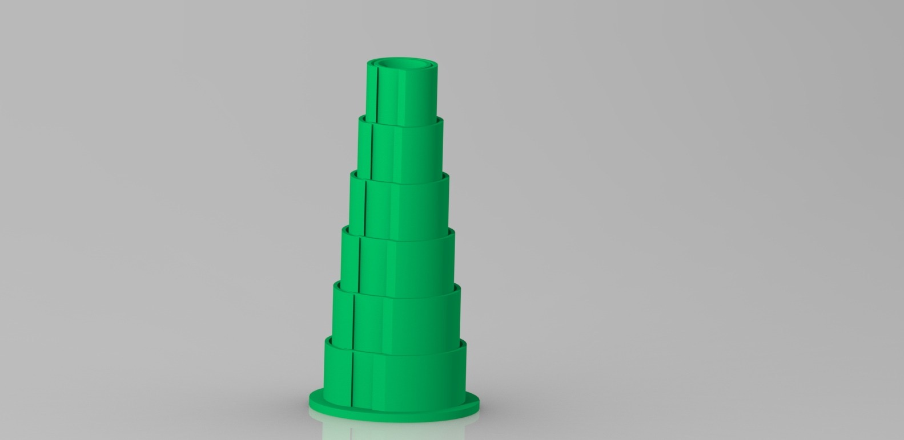
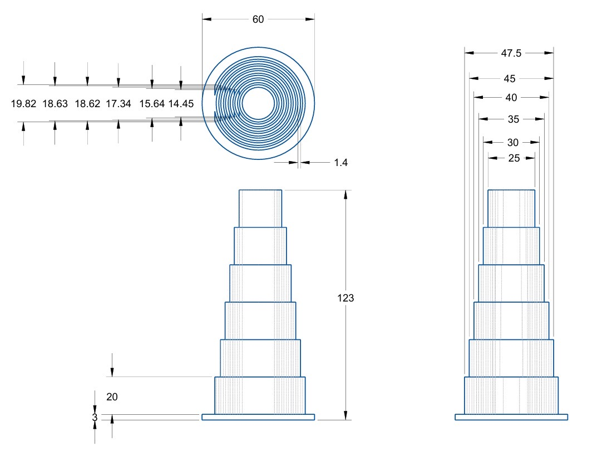
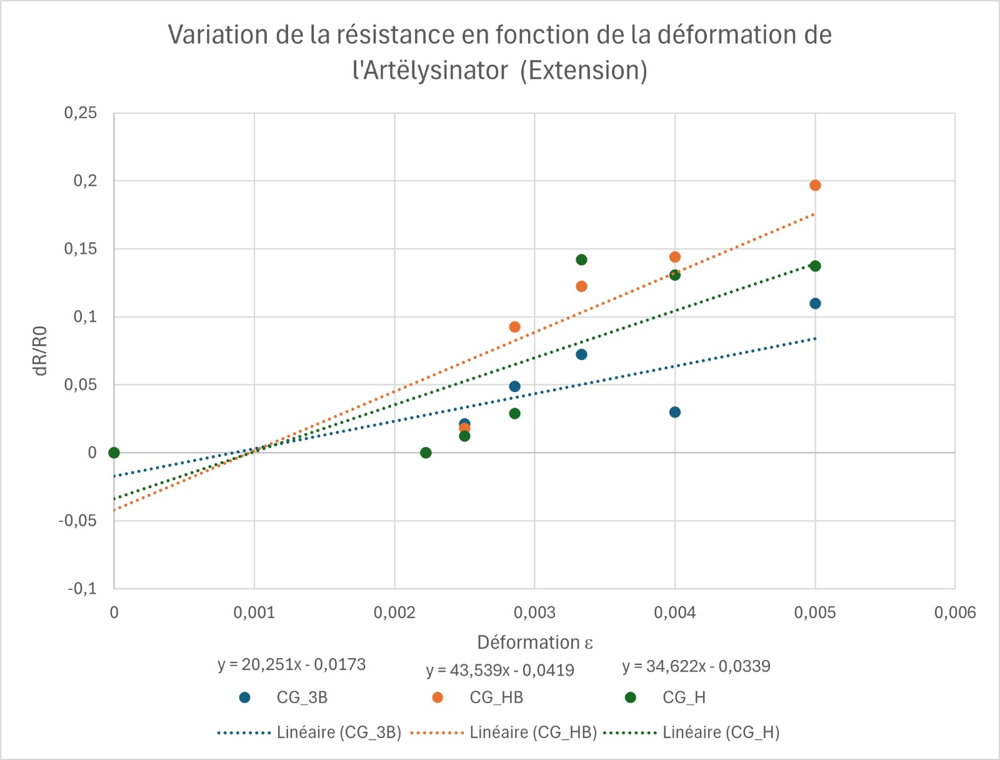
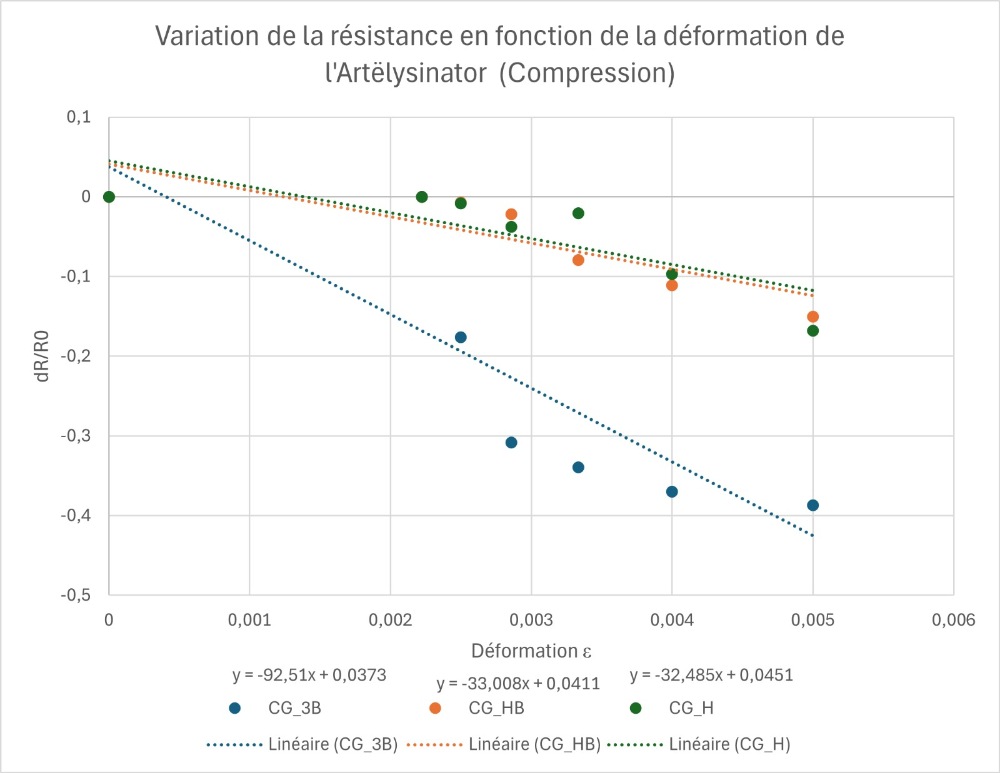
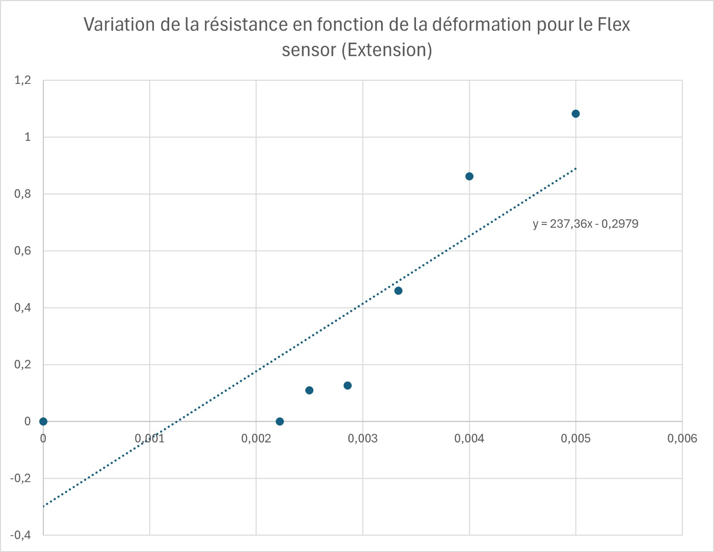

# 2024-2025-4GP-Maelys-chr-Buhahahhahah

## Sommaire

1. [Présentation du projet](#présentation-du-projet)  
2. [Livrables](#livrables)  
3. [Matériel nécessaire](#matériel-nécessaire)  
4. [Simulation du circuit électronique sous LTspice](#simulation-du-circuit-électronique-sous-ltspice)  
5. [Création de notre PCB sous KiCad](#création-de-notre-pcb-sous-kicad)
6. [Fabrication du shield](#fabrication-du-shield)
7. [Programme Arduino](#programme-arduino)  
8. [Application Android APK sous MIT App Inventor](#application-android-apk-sous-mit-app-inventor)   
9. [Banc de test](#banc-de-test)   
10. [Datasheet](#datasheet)  
11. [Conclusion](#conclusion)  
12. [Contacts](#contacts)

## 1. Présentation du projet
Ce projet s’inscrit dans le cadre de l’Unité de Formation « Du capteur au banc de test » du département Génie Physique de l’INSA Toulouse. Inspiré de l’article "Pencil Drawn Strain Gauges and Chemiresistor on Paper", publié en 2014 dans Scientific Reports, l’objectif est de concevoir un capteur de déformation low-tech à base de papier et de graphite. 

Le principe repose sur le fait que, lors d’une déformation du papier, la distance entre les particules de graphite préalablement déposées varie selon qu’il s’agisse d’une tension ou d’une compression. Cette variation entraîne une modification de la conductivité, et donc de la résistance électrique de la couche de graphite. Il est ainsi possible de mesurer cette variation de résistance pour en déduire la déformation appliquée. L’objectif du projet était de concevoir ce capteur dans son intégralité, en suivant toutes les étapes de développement : du design et de la fabrication du circuit imprimé (PCB), jusqu’à la programmation et aux tests du capteur.

## 2. Livrables
Pour ce projet, nous avions différents livrables à rendre : 

- Un shield PCB fonctionnel connecté à une carte Arduino UNO. Notre PCB contient un amplificateur transimpédance, un capteur bluetooth, un écran OLED. Ainsi qu'un flex sensor, un servo moteur, un potentiomètre digital et un encodeur rotatoir. Nous avons également rajouté une led de couleur bleu. 
- Un code Arduino permettant de gérer le module bluetooth ainsi que les mesures du capteur de déformation et nos différents composants présent sur notre PCB.
- Une application Android APK développée à l’aide du site MIT app inventor.
- Un Banc de test que nous avons fabriqué
- Une datasheet du capteur de contrainte

## 3. Matériel nécessaire
- Résistances : 1 de 1 kOhms, 1 de 10 kOhms, 2 de 100 kOhms pour l'amplificateur transimpédance. 1 de 320 Ohms pour la Led et 1 de 10 kOhms pour le flex sensor
- Capacités : 2 de 100 nF, 1 de 1 uF pour l'amplificateur transimpédance.
- Arduino Uno
- Amplificateur opérationnel LTC1050
- Module Bluetooth HC05
- Encodeur rotatoire 
- Ecran OLED 128x64
- Potientomètre digital MCP41050
- Flex Sensor
- Servo moteur
- Led
  
## 4. Simulation du circuit électronique sous LTSpice
Ce dossier contient le schéma du circuit analogique associé au capteur graphite. Celui-ci intègre un amplificateur transimpédance ainsi que plusieurs filtres passe-bas, permettant d’obtenir un signal exploitable par la suite.

Le capteur délivre un courant très faible, de l’ordre de 100 nA en moyenne. Sans traitement, ce signal serait difficile à exploiter. L’amplificateur permet donc de convertir ce courant en une tension mesurable, tandis que les filtres atténuent les perturbations indésirables.

Les interférences à 50 Hz, liées au réseau électrique, ainsi que d’autres parasites (bruits de l’alimentation, de l’horloge, etc.) peuvent fortement impacter la qualité du signal. C’est pourquoi un filtrage soigneux est nécessaire.

### Choix de l’amplificateur
Nous avons choisi l’amplificateur opérationnel (AOP) LTC1050 car il est spécifiquement conçu pour traiter de très faibles courants d’entrée. Son offset de tension très faible garantit une grande précision dans la conversion courant/tension.

### Les filtres
Trois filtres ont été intégrés au circuit :

- 🟨 Rectangle jaune : simulation du capteur  
- 🟧 Rectangle orange + R5 : simulation du bruit 

Et trois autres filtres, visibles sur le schéma, assurent le nettoyage du signal :

- 🟩 Filtre en entrée (R1, C1 – vert) : filtre passe-bas passif, fréquence de coupure ≈ 16 Hz, pour atténuer les bruits en courant dès l’entrée du signal.  
- 🟥 Filtre dans la boucle AOP (R3, C4 – rouge) : filtre passe-bas, fréquence de coupure ≈ 1,6 Hz, efficace contre les interférences à 50 Hz du réseau électrique.  
- 🟪 Filtre en sortie (R6, C2 – violet) : filtre passe-bas passif avec une fréquence de coupure d’environ 1,6 kHz, pour éliminer les parasites générés lors du traitement du signal.

### Schéma de simulation

## 5. Conception de notre PCB sous Kicad
Cette étape du projet avait pour objectif de concevoir le PCB du circuit transimpédance à l’aide du logiciel KiCad, en s’appuyant sur un template de carte Arduino Uno. Plusieurs étapes ont été nécessaires :

- **Création de la schématique** du circuit transimpédance, incluant la définition de symboles personnalisés pour les composants absents de la bibliothèque KiCad.
- **Conception des empreintes physiques** de ces composants, en prenant en compte leurs caractéristiques techniques : nombre de pins, espacement, dimensions, géométrie, etc.
- **Routage du circuit** généré via la vue schématique.
- **Mise en place d’un plan de masse** pour relier efficacement les pistes au GND.

Voici le schéma électrique de l'ensemble de notre montage :

Nous avons conçu les empreintes physiques de nos composants afin de pouvoir les positionner correctement sur le PCB et nous avons fait le routage.
La principale difficulté rencontrée a été d’optimiser le placement des composants afin d’éviter l’utilisation de vias, notamment pour les connexions au plan de masse (GND).
Objectif réussi nous avons utilisé 0 via !

Voici le résultat final obtenu de notre routage :
 

 

Voici la version 3D : 

### ⚠️ Remarques importantes pour les futurs étudiants !!!

Au cours de notre projet, nous avons rencontré plusieurs erreurs qu’il est important de signaler afin d’éviter qu’elles ne se reproduisent :

- **Encodeur rotatoire** :  
  Le modèle présent dans KiCad ne correspondait pas exactement au composant réel que nous avons utilisé. Il a donc été nécessaire d'interchanger les connexions des broches Switch et Clock.

- **Servomoteur** :  
  Les broches GND et 5V étaient inversées par rapport au modèle. Nous avons résolu ce problème en utilisant un connecteur permettant de corriger le câblage.

- **Potentiomètre numérique** :  
  La broche CS (Chip Select) doit être connectée à la pin 10 de l’Arduino, et non à la pin 12, cette dernière étant utilisée par la bibliothèque SPI n'est pas disponile.

- **Entrée de l’amplificateur opérationnel** :  
  Les entrées **+** et **–** de l’AOP ont été inversées par erreur. Il est important de bien vérifier leur affectation dans le schéma et lors du câblage.

## 6. Fabrication du shield 
Grâce à notre projet réalisé sous KiCad, nous avons pu générer le masque de gravure de notre PCB. Nous avons ensuite transmis notre fichier à Cathy, qui s’est chargée de l’impression et de la fabrication du circuit.

Elle a procédé ainsi :

1. Impression du calque de la PCB
2. Insolation UV d’une plaque en époxy recouverte d’une fine couche de cuivre et d’une résine photosensible.
3. Développement de la plaque dans un révélateur pour éliminer la résine non exposée.
4. Gravure des pistes dans un bain de perchlorure de fer, afin de retirer le cuivre non protégé.
5. Nettoyage final à l’acétone pour enlever les résidus de résine restants.

Un grand merci à Cathy pour le temps qu’elle a consacré à la fabrication de notre PCB!

### Assemblage du circuit
Nous avons ensuite réalisé le perçage de la plaquette afin de pouvoir y insérer les différents composants selon le schéma généré avec KiCad.  
Une fois le perçage terminé, nous avons procédé à la soudure des composants sur la carte, en respectant le plan de câblage.

  
  

## 7. Programme Arduino 
Notre code contient les instructions nécessaires au bon fonctionnement de l’Arduino.  
Il permet de traiter les données reçues du capteur graphite et de les transmettre au module Bluetooth HC-05, qui communique avec l’application APK. Il gère également l’interaction avec le potentiomètre digital ainsi qu’avec l’écran OLED. De plus au niveau de notre code Arduino, il prend 10 mesures à la fois et envoie une moyenne arithmétique, le bruit à donc moins d'impact. 
Plusieurs bibliothèques sont intégrées pour faciliter ces communications :

- **Adafruit_SSD1306** : simplifie l’affichage des informations sur l’écran OLED  
- **SPI** : permet de communiquer les nouvelles valeurs sur le potentiomètre digital
- **SoftwareSerial** : permet la communication avec le module Bluetooth HC-05  

Nous avons conçu un menu interactif composé de 4 options, accessible via l'encodeur rotatoire. Celui-ci permet de naviguer entre les différentes options, et une simple pression sur le bouton intégré permet de sélectionner et activer l’option souhaitée. 

Voici notre menu : 

1. **Configuration du capteur graphite**
   - Met à jour la valeur du potentiomètre digital
   - Récupère la résistance à plat (R₀)
   - Transmet les données à l’application via Bluetooth

2. **Configuration du capteur flex sensor**
   - Récupère la valeur de la résistance de référence (R₀)
   - Transmet les données à l’application via Bluetooth

3. **Mesure du capteur graphite**
   - Envoie des données ponctuelles du capteur graphite
   - Les données sont reçues par l’application et enregistrées dans un fichier texte

4. **Mesure du capteur flex sensor**
   - Envoie des données ponctuelles du capteur flex
   - Les données sont également reçues par l’application et sauvegardées dans un fichier texte
  
## 8. Application Android APK sous MIT App Inventor
Nous avons développé une application Android à l’aide de la plateforme MIT App Inventor. Cette application permet de recevoir les données envoyées par la carte Arduino via une connexion Bluetooth, établie grâce au module HC-05 intégré au shield de la carte.

Une fois la connexion Bluetooth établie, l’application après chaque mesure :

- Un **graphe dynamique** représentant l’évolution de la résistance du capteur graphite et du capteur flex en fonction et des contraintes appliquées.
- La **valeur instantanée** de cette résistance.

L'algorthme d'utilisation étant suivant : 
  1) A l'aide l'encodeur rotatoire naviguer vers "Conf. CG" ou "Conf. Flex" en fonction de ce que vous avez besoin de mésurer, puis appuyer sur le l'encodeur
  2) Naviguer vers "Mes. CG" ou "Mes. Flex", et appuyer sur l'encodeur quand le capteur sera positionné sous le contrainte souhaité (initialement ça a été conçu pour notre banc de test, de 10mm à 22.5mm de rayon de courbure)
  3) Appuyer encore plusieurs fois (tant que le led bleu est allumée)
  4) Récuperer le fichier dans las déstination Documents/MOSH/ de votre téléphone
     
Voici notre application : 
 

 
## 9. Banc de test
Afin de spécifier le comportement de notre capteur graphite avec son montage transimpédance, avec le binôme de Tristan et Yannis nous avons conçu et fabriqué notre propre banc de test au FabLab de l’INSA.

Ce dispositif se compose de demis-cercles de diamètres différents avec des trous préfabriqués, permettant d’insérer facilement le capteur. Une fois placé dans l’un des trous, le capteur épouse la courbure du demi-cercle correspondant. Cette contrainte appliquée provoque une variation de sa résistance électrique, que nous mesurons.

Ces demi-cercles, utilisés pour appliquer une contrainte progressive sur le capteur, présentent les caractéristiques suivantes :

- Diamètre du plus petit demi-cercle : 20 mm
- Diamètre du plus grand demi-cercle : 45 mm
- Incrément entre chaque modèle : 5 mm

Ce montage nous permet de relier la déformation mécanique :
ε = e / D

à la variation relative de la résistance :
ΔR / R₀

où :
- e = 0,2 mm correspond à l’épaisseur du papier conducteur utilisé
- D est le diamètre du demi-cercle sélectionné

Voici notre banc de test avec ses dimensions : 

  
  

Nous avons ensuite tracé les courbes caractéristiques obtenues pour des crayons de duretés différentes (3B,HB et H) en situation de tension ou de compression, afin d’évaluer la réponse du capteur.

  
  

En théorie, lorsque le capteur est soumis en tension, la monocouche de graphite déposée sur le papier s’étire, ce qui augmente la distance entre les atomes de carbone. Cette augmentation de distance entraîne une hausse de la résistance du capteur. À l’inverse, lorsqu’il est soumis à une compression, les atomes de carbone se rapprochent, ce qui réduit la résistance du capteur. La variation relative de résistance dépend également du type de crayon utilisé pour tracer la couche de graphite. Plus le crayon est gras (par exemple, du H vers le HB jusqu’au 3B, qui contient le plus de carbone), plus la variation relative de résistance est faible. Bien que la théorie prévoie une augmentation de la résistance en tension et une diminution en compression, nos résultats expérimentaux ne suivent pas totalement cette tendance attendue :

#### Compression  
Sur la courbe de compression, on observe bien une diminution de la résistance relative \( \Delta R / R_0 \) lorsque la déformation augmente.  
En revanche, le graphite 3B, censé avoir une plus faible variation relative en théorie (car moins conducteur), présente ici la plus grande variation de résistance.

#### Extension  
En tension, les résultats montrent bien une augmentation de la résistance avec la déformation. Cependant, contrairement à la théorie, le crayon HB présente ici la variation la plus élevée, suivi du H, tandis que le 3B varie beaucoup moins. Cela contredit l’idée selon laquelle les crayons les plus dures (ici H) varient le plus.

#### Interprétation 
En effet, plusieurs facteurs influencent le comportement réel du capteur :
- L’uniformité du dépôt de graphite sur le capteur.
- La qualité des crayons 
- Le contact électrique entre le graphite et les pinces.

### Comparaison entre le capteur graphite et le capteur Flex sensor commercial

Nous avons comparé les performances de notre capteur graphite artisanal à un capteur flex commercial. La comparaison s’appuie sur les résultats expérimentaux obtenus en extension :

Les courbes montrent que le flex sensor présente une variation relative de résistance nettement plus marquée que nos capteurs en graphite.

- **Capteur Flex sensor** : pente ≈ **237,36**
- **Capteur graphite HB** : pente ≈ **43,5**
- **Capteur graphite H** : pente ≈ **34,6**
- **Capteur graphite 3B** : pente ≈ **20,3**

Le capteur Flex est donc beaucoup plus sensible à la déformation. Sa réponse est plus régulière, linéaire et plus exploitable en conditions réelles.

## Datasheet 
## Conclusion
Industrialisation du capteur graphite – Est-ce envisageable ?

- Le **capteur graphite** est une solution low-cost. Toutefois, il reste moins précis, plus bruité et moins robuste face aux manipulations répétée. Cependant, il présente des avantages important comme le fait de pouvoir choisir la forme du capteur ainsi que la manière dont on souhaite déposer le graphite. Grâce à notre capteur on peut mesurer la variation de la resistance en fonction de la tension et de la compression. 
- Le **flex sensor** offre une très bonne sensibilité, une meilleure fiabilité, et une stabilité supérieure sur le long terme. Il est donc plus adapté aux applications industrielles, même si son coût est plus élevé. Cependant, le flex sensor permet de mesurer la variation de la résistance que en fonction de la tension. 

Notre capteur graphite remplit bien son rôle dans le cadre d’une expérimentation à faible coût, mais reste limité pour des usages où la précision et la répétabilité sont essentielles.

### Vers une industrialisation possible : pistes d'amélioration

Bien que notre capteur graphite artisanal ne soit pas directement industrialisable, plusieurs pistes d’amélioration permettraient d’envisager une version plus robuste, homogène et durable, adaptée à une production en série.

#### Structure et matériaux

- Remplacer le papier par un support plastique souple permettrait d’augmenter considérablement la durée de vie du capteur.
- Alternativement, le papier peut être traité ou plastifié, afin de le protéger de l’humidité et des dégradations mécaniques tout en conservant sa flexibilité.
- Encapsuler le capteur entre deux couches de plastique le protégerait des frottements, de la poussière et de l’humidité.

#### Dépôt du graphite

- Pour garantir une bonne homogénéité et une reproductibilité industrielle :
  - Saturer la zone sensible en graphite, en déposant une grande quantité de matière,
  - Utiliser des motifs de colle comme guide, puis saupoudrer de la poudre de graphite,
  - Fixer la couche de graphite de manière durable, pour éviter qu’elle ne s'efface ou se dégrade avec le temps.

#### Connectique

- En remplaçant les pinces crocos par des plaques métalliques conductrices insérées entre les deux couches de plastique, on obtiendrait une connexion plus fiable.
- Ce système permettrait également une meilleure intégration dans des circuits électroniques.

#### Bénéfices attendus

Ces améliorations permettraient :
- Une meilleure homogénéité du comportement du capteur,
- Une réduction de la sensibilité aux conditions environnementales (humidité, poussière, frottements),
- Une durée de vie allongée,
- Une intégration facilitée dans des applications à bas coût ou semi-industrielles.

## Contacts

Pour toutes questions éventuelles vous pouvez nous contacter par mail : 
- Atrur Nersisyan : nersisya@insa-toulouse.fr
- Maelys Christien : christien@insa-toulouse.fr

